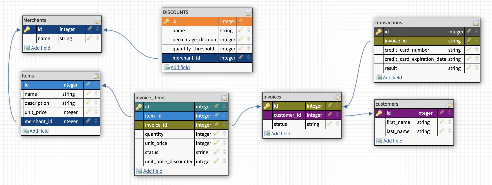

## Table of contents
* [General info](#general-info)
* [Database Schema](#database-schema)
* [Learning Goals/Areas of Focus](#learning-goals)
* [Bulk Discount Scenarios](#bulk-discount-scenarios)
* [Technologies](#technologies)
* [Setup](#setup)
* [Features](#features)
* [Status](#status)
* [Contact](#contact)

## General info
This project an extension of a previous project - "Little Esty Shop." It adds functionality for merchants to create bulk discounts for their items. “Bulk discounts” are discounts based on the quantity of items the customer is buying, for example “20% off orders of 10 or more items”.

## Database Schema


## Learning Goals / Areas of Focus
* Practice TDD
   * Write model tests that fully cover the data logic of the application
   * Write feature tests that fully cover the functionality of the application
* Write migrations to create tables and relationships between tables
* Implement CRUD functionality for a resource using forms (form_tag or form_with), buttons, and links
* Use MVC to organize code effectively, limiting the amount of logic included in views and controllers
* Use built-in ActiveRecord methods to join multiple tables of data, make calculations, and group data based on one or more attributes

## Bulk Discount Scenarios
Bulk discount logic handles the following cases:
```
Example 1

Merchant A has one Bulk Discount
Bulk Discount A is 20% off 10 items
Invoice A includes two of Merchant A’s items
Item A is ordered in a quantity of 5
Item B is ordered in a quantity of 5
In this example, no bulk discounts should be applied.

Example 2

Merchant A has one Bulk Discount
Bulk Discount A is 20% off 10 items
Invoice A includes two of Merchant A’s items
Item A is ordered in a quantity of 10
Item B is ordered in a quantity of 5
In this example, Item A should be discounted at 20% off. Item B should not be discounted.

Example 3

Merchant A has two Bulk Discounts
Bulk Discount A is 20% off 10 items
Bulk Discount B is 30% off 15 items
Invoice A includes two of Merchant A’s items
Item A is ordered in a quantity of 12
Item B is ordered in a quantity of 15
In this example, Item A should discounted at 20% off, and Item B should discounted at 30% off.

Example 4

Merchant A has two Bulk Discounts
Bulk Discount A is 20% off 10 items
Bulk Discount B is 15% off 15 items
Invoice A includes two of Merchant A’s items
Item A is ordered in a quantity of 12
Item B is ordered in a quantity of 15
In this example, Both Item A and Item B should discounted at 20% off. Additionally, there is no scenario where Bulk Discount B can ever be applied.

Example 5

Merchant A has two Bulk Discounts
Bulk Discount A is 20% off 10 items
Bulk Discount B is 30% off 15 items
Merchant B has no Bulk Discounts
Invoice A includes two of Merchant A’s items
Item A1 is ordered in a quantity of 12
Item A2 is ordered in a quantity of 15
Invoice A also includes one of Merchant B’s items
Item B is ordered in a quantity of 15
In this example, Item A1 should discounted at 20% off, and Item A2 should discounted at 30% off. Item B should not be discounted.
```

## Technologies
Project is created with:
* Ruby version 2.5.3
* Rails version 5.2.5
* PostgeSQL

## Setup
To run this program:

1. To run this program, view in browser

Open the browser of your choice and navigate to:
'''
https://pumpkin-pie-69630.herokuapp.com/
'''

1. From this repository, press the green "clone" button and then copy the link
   by pressing the Copy To Clipboard icon.
1. Navigate to the folder where you want to save it and enter:
    '''
    $ git clone <copied link>
   '''
1. Navigate into the new folder containing this project
   '''
   $ cd recreational_rails
   '''
1. Install required gem files
   '''
   $ bundle install
   '''

Connecting to the database & starting the server:

1. Make sure the app PostgreSQL is running
1. Run the following commands:
   '''
   $ rails s
   $ rails db{drop,create,migrate,seed}
   '''

View in browser
1. Open the browser of your choice and navigate to:
   '''
   http://localhost:3000/
   '''

## Features
List of features ready and TODOs for future development
* CRUD functionality - Merchants can create, update, and delete discounts
* API consumption - The next three US public holidays are displayed using
  Nager.Date API
* Bulk Discounts calculated when finding total revenues
* Links to discounts displayed when present for a given item on an invoice
* Use of before actions in app controllers
* Rails Resource Routing
* Use of Partials for Forms and Navigation bars

To-do list:
* ActiveRecord refactoring

## Status
Project is: _in progress_

## Contact
Created by
* [@joemecha](https://github.com/joemecha)

~ feel free to contact me ~


